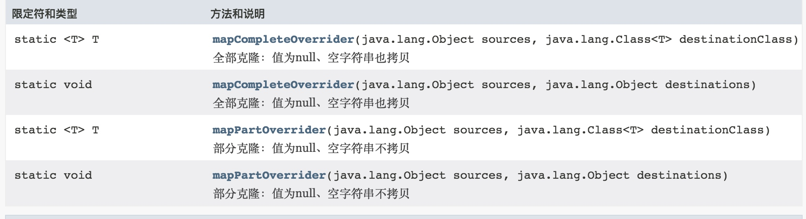

## BeanPowerHelper

基于dozer实现的深度克隆工具类，相对于BeanHelper 功能更强大，支持枚举或其他类型字段的克隆（对象复制）

### 包名
com.deepexi.util.BeanPowerHelper
（支持复杂类型，比如枚举等）


#### 方法列表



#### 简单使用


```
package com.deepexi.util;/**
 * Created by chenshaowen on 2018/11/24.
 */

import org.junit.Test;

import java.util.HashMap;
import java.util.Map;

/**
 * program: optimus-common
 * <p>
 * description: 深度克隆工具test
 *
 * @author: shaowin
 * <p>
 * created on : 2018-11-24 13:27
 **/
public class BeanPowerHelperTest {

    String name;

    String sex;

    public String getName() {
        return name;
    }

    public void setName(String name) {
        this.name = name;
    }

    public String getSex() {
        return sex;
    }

    public void setSex(String sex) {
        this.sex = sex;
    }

    @Test
    public  void mapPartOverrider() {
        Map orig=new HashMap();
        orig.put("name","orig");
        orig.put("sex","sex1");
        BeanPowerHelperTest dest=BeanPowerHelper.mapPartOverrider(orig,BeanPowerHelperTest.class);
        System.out.println("mapPartOverrider[orig]:"+JsonUtil.bean2JsonString(orig));
        System.out.println("mapPartOverrider[dest]:"+JsonUtil.bean2JsonString(dest));

        Map s1=new HashMap();
        s1.put("name","s1");
        s1.put("sex","");
        System.out.println("mapPartOverrider[orig]:"+JsonUtil.bean2JsonString(s1));
        System.out.println("mapPartOverrider:"+JsonUtil.bean2JsonString(BeanPowerHelper.mapPartOverrider(s1,BeanPowerHelperTest.class)));

        Map s2=new HashMap();
        s2.put("name","s2");
        s2.put("sex","");
        System.out.println("复制前:mapPartOverrider[orig1]:"+JsonUtil.bean2JsonString(s2));
        System.out.println("复制前：mapPartOverrider[dest]:"+JsonUtil.bean2JsonString(dest));
        BeanPowerHelper.mapPartOverrider(s2,dest);
        System.out.println("复制后：mapPartOverrider:"+JsonUtil.bean2JsonString(dest));

        System.out.println("复制后：mapCompleteOverrider:"+JsonUtil.bean2JsonString(BeanPowerHelper.mapCompleteOverrider(s2,BeanPowerHelperTest.class)));


    }
}

```

输出结果


```
mapPartOverrider[orig]:{"sex":"sex1","name":"orig"}
    mapPartOverrider[dest]:{"name":"orig","sex":"sex1"}
    mapPartOverrider[orig]:{"sex":"","name":"s1"}
    mapPartOverrider:{"name":"s1"}
    复制前:mapPartOverrider[orig1]:{"sex":"","name":"s2"}
    复制前：mapPartOverrider[dest]:{"name":"orig","sex":"sex1"}
    复制后：mapPartOverrider:{"name":"s2","sex":"sex1"}
    复制后：mapCompleteOverrider:{"name":"s2","sex":""}
```


